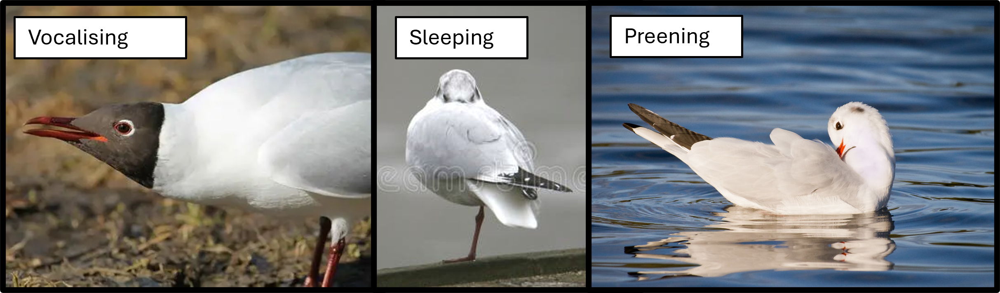
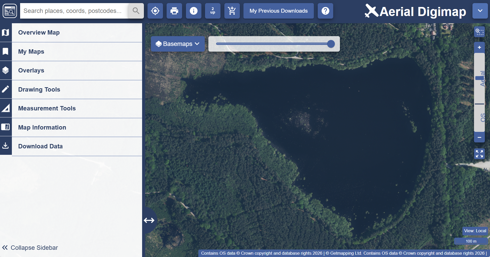

```{r setup, include=FALSE}
knitr::opts_chunk$set(echo = TRUE)
```

------------------------------------------------------------------------

 **This practical is under development.**

Built with `r getRversion()`

```{r, echo = F}

```

::: {style="background-color: #64B080; padding: 0.2px; border-left: 5px solid #31573B;"}
# Introduction
:::

**Welcome** to the practical classes of the final investigation of ENVS278: Marine Ecology Field Studies! For those of you I haven't met, my name is Ellie and I am a university teacher in marine biology and ecology here in the School of Earth and Environmental Sciences at Liverpool. My [own research](https://link.springer.com/article/10.1007/s00227-025-04657-w) looks at how an **Antarctic seabird**, the snow petrel, uses sea ice habitats. For this, I use a combination of biotelemetry (through GPS tracking) and biogeochemistry (for investigating their diet). In general, my interests are in ***what drives how animals interact with their environment.***

At Blakemere Moss, you collected...

Two four-hour computer practicals. From these sessions, you will achieve the following **Learning Outcomes:**

1.  Collate and format the data you collected into the field into a format suitable for analyses in R
2.  Learn how to create a project in R
3.  Learn how to load your data into R and conduct preliminary analyses
4.  (add detail on actual analyses)
5.  (add detail on actual analyses)
6.  Produce a map of the study area and export it for use in your report


(bit about data being used in report)

::: {style="background-color: #89F0AF; padding: 0.01px; border-left: 5px solid #31573B;"}
## How to follow this practical guide
:::

This webpage will guide you fully through analysing and visualising your own field data, which we collected in groups at Blakemere Moss.

::: {style="background-color: #89F0AF; padding: 0.01px; border-left: 5px solid #31573B;"}
## R & RStudio
:::

```{r, echo = FALSE, out.width = "50%"}
knitr::include_graphics("photos/R-and-Rstudio.png")
```

One of the aims of these practical sessions is to familiarise you...

R and RStudio are some of the most frequently used softwares in ecology. They are free, open-source tools widely used for data analysis, statistics, and geospatial work.

**If you are working on a university computer:**

Check version.

**If you are not working on a university computer:**

-   To get started, first download **R** from the [[**Comprehensive R Archive Network**]{.underline} **(CRAN)**,](https://cran.r-project.org/bin/windows/base/) which provides the core programming language and statistical environment.

-   After installing R, [download **RStudio** from **Posit**.](https://posit.co/downloads/) RStudio is an integrated development environment (IDE) that makes it easier to write code, manage projects, visualize data, and install packages.

Together, R and RStudio provide a powerful platform for analysing environmental and spatial datasets used in GIS and environmental science.

::: {style="background-color: #89F0AF; padding: 0.01px; border-left: 5px solid #31573B;"}
## Learning R
:::

::: {style="background-color: #FFFF08; padding: 10px; border-left: 5px solid #FFFF08;"}
**TASK:** Please read the (short) introductory chapter of [R for Data Science](https://r4ds.hadley.nz/) - this should only take 5 - 10 minutes and will provide you with a good foundation for the rest of the practical.
:::

There are also some excellent tutorials available on Youtube, and I've listed a few of my favourites below:

Specifically for spatial data, I also have a webpage where I collate useful resources (those of you on ENVS255 will be familiar with it):

-   <https://e-honan.github.io/GIS-Resources/> *(this webpage is currently under development and will be updated regularly!)*

# PRACTICAL SESSION 1

------------------------------------------------------------------------

::: {style="background-color: #64B080; padding: 0.2px; border-left: 5px solid #31573B;"}
# Formatting your data from the field
:::

***30 - 40 minutes***

------------------------------------------------------------------------

# Setting up your workspace

## The RStudio environment

Picture of labelled console etc

## Working with projects in R

-   File \> New Project…
-   Select ‘New Directory’
-   For the Project Type select ‘New Project’
-   For Directory name, call it something like “ENVS278_Gull_Practicals” (without the quotes!)
-   For the sub-directory, select somewhere you will remember (like “My Documents” or “Desktop”)

## Data hygiene

Hierarchical file systems

## Opening your first R script

An R script is a plain text file that contains a series of R commands you can run. An R script is saved with the extension '.R'.

To create a new script.

Press save, and give the script a sensible title, like "ENVS278_Gulls_Prac_1". Save it to the 'code' folder in your R project folder.

Add a title to your script with a brief description of what it contains. Use hashtags to tell R that the title is **not** code.

```{r}
# You can use hashtags to tell R that a line is not a piece of code, and use them to add notes to your R script
```

Example title:

```{r}
# ENVS278 Practical 1
# Black-headed Gull Behaviour
# yy/mm/dd

```

## Your toolbox: Loading R packages

discuss Install vs library

-   A package bundles together code, data, documentation, and tests, and is easy to share with others [(Wickham & Bryan)](https://r-pkgs.org/)

You install R packages using the syntax: `install.packages("package_name")`

```{r, eval = F}
# install the package
install.packages("tidyverse")
```

If you want to install several packages at once, you can do so using the following syntax:

```{r, eval = F, warning = F, message = F}
# install the packages 'cowplot' and 'ggpubr'
install.packages(c("cowplot", "ggpubr"))
```

Once installed (which you should only have to do once), you can start your R session by loading the package into your library for that session. Note that when installing a package you use "" around the package name, but not when loading it to your library.

You load the installed R packages to your library using the syntax: `library(package_name)`

```{r, eval = T, warning = F, message = F}
# load the package 'tidyverse' into your library
library(tidyverse)
```

The syntax for loading multiple libraries is not the same as installing multiple packages. If you're comfortable with R, and would like to try loading multiple libraries at once, the code for this is in the [Optional Extras](#optional-extras) section at the end of this webpage.

If you're getting started with R, the simplest way to load multiple packages is just to manually list them:

```{r, eval = F}
# load ggpubr and cowplot to your library
library(ggpubr)
library(cowplot)
```

::: {style="background-color: #CAB3E8; padding: 10px; border-left: 5px solid #3399ff;"}
**NOTE:** You should only need to install a package once, but you will have to add it to the library for each R session.
:::

## Formatting your data and loading your data to R

## Viewing your data

Using pipes: In the code above, we chain together multiple commands with the pipe operator (%\>%). When you see the pipe, you can interpret this as the words “and then”. If we wrote this as pseudocode, it would read:

------------------------------------------------------------------------

# Preliminary analyses

## Observer Bias: Cohen's Kappa

-   Need to check reliability of data

-   Having multiple observers in the same project introduces bias

-   This can be reduced by testing inter-rater reliability

-   To make sure everyone is on the same page

-   Cohen’s kappa test

-   Tests consensus against disagreement…

-   Produces a number between 0-1

-   0.8 is generally considered an acceptable score

Before moving onto the next session, make sure all the dyads within your data collection group have achieved a Cohen's kappa coefficient of \>0.8

------------------------------------------------------------------------

# Data visualisation in R

> [!IMPORTANT]\
> Keep it accesibile.

`ggplot2` is the best package for plotting data in R, offering a plethora of options for customization. There are many tutorials out there, but I've found the best way of thinking of any ggplot plot is the 'layer cake' analogy:

```{r, eval = F}
install.packages("ggplot2")
```


```{r, eval = T, warning = F, message = F}
library(ggplot2)
```

## Visualing count data

Change through time in attendance etc - (plot, annotate, explain)

# PRACTICAL SESSION 2

# Time-budgets

-   Visualising the behavioural data:
-   Time budget (time in state, box plots/ violins/ distributions)
-   Multiple visualisation techniques – start with pie chart (highlight no visualisation of variance)
-   The box plot
-   Time budget (time in state, box plots/ violins/ distributions)
-   Try visualise the offset violin thing Jon sketched
-   Interaction data?

# Making a map of your study area

A good map is an important component of most scientific reports. In previous modules you may have used the software QGIS to produce maps visualizing animal movement data. However, you can also use R to create publication quality maps!

In this next section, we're going to walk through how to generate a basic map in R, and you will be introduced to some useful repositories for sourcing base-maps and working with spatial data in R.

Make a new R script and call it something sensible. Save it to your "code" folder in your project repository.

```{r}
# ENVS278 Practical 1
# Map of study area
# yy/mm/dd

```

## Setting up your script

### Packages for spatial data

[sf](https://r-spatial.github.io/sf/) (standing for "simple features") is the workhorse package of handling spatial data in R.

```{r, eval = F}
# install the package
install.packages("sf")
```

```{r, eval = T, warning = F, message = F}
# load the package into your library
library(sf)
```

For working with rasters in R, [terra](https://rspatial.github.io/terra/index.html) is a great package to start with.

```{r, eval = F}
# install the package
install.packages("terra")
```

```{r, eval = T, warning = F, message = F}
# load the package into your library
library(terra)
```

When beginning to create maps in R, the package [rnaturalearth](https://docs.ropensci.org/rnaturalearth/articles/rnaturalearth.html) is a good resource. [Natural Earth](https://www.naturalearthdata.com/) is a public domain map dataset including vector country and other administrative boundaries.

```{r, eval = F}
# install the package
install.packages("rnaturalearth")
```

```{r, eval = T, warning = F}
# load the package into your library
library(rnaturalearth)
```

However, for the spatial scale of map we're making, we may need higher resolution data than available on `rnaturalearth`.

### Downloading high resolution imagery of the fieldsite

Before we begin to produce the map in R, we need to source a good basemap. There are several packages ... high res so easier to load in...

-   Log into the [EDINA Digimap](https://digimap.edina.ac.uk/) service (you should have already registered; if not, do so now)
-   Search “University of Liverpool” as the organisation you would like to sign in with
-   Sign in with your usual University log in
-   Press Licence Agreements (Top of screen) and select all
-   Accept terms and conditions (for all)
-   Purpose -\> Academic Works (for all)
-   Next -\> Submit -\> Continue
-   This now gives you access to base maps from both of these collections
-   Now return to the Digimap homepage

In previous practicals you may have used topographic information...

For the purpose of visualisation, we're going to use high resolution aerial imagery.

-   On the Digimap home page, click "Aerial"
-   Click "Aerial Digimap" above "View Maps and dDwnload Data - View, annotate and print maps, plus download data for GIS/CAD."
-   Zoom to Blakemere Moss

```{r, echo = F}

```

-   Click "Download Data" and "Select visible area". This will select the area you have zoomed to.
-   Under "Select Data Products" select the box for "High Resolution (25cm)"

You'll notice it may say "(2/98) tiles", where 4 could be any number. We'll get to that shortly.

-   Click "Add to Basket"
-   Press download. It may take a few moments for your files to arrive in your inbox.

Your files will arrive as a .zip file. Extract them into the 'aerial_maps' folder in your R project directory.

### Load in your station locations

Now we'll read in the csv of station locations so that we can visualise them.

```{r, eval = T}
station_locs <- read.csv("map_data/ENVS278_Blakemere_Moss_locs.csv")
```

Check the file structure:

```{r, eval = T}
head(station_locs)
```

## Making your map

You'll notice the aerial images downloads as multiple files. We need to merge these into one composite map. 

### Load our aerial images into R and convert to rasters: 

```{r, eval = T}
# First we define the folder path. The trailing / just indicates it's a folder.

folder <- "C:/Users/ehonan/Downloads/Download_aerial_image_2953620/getmapping-rgb-25cm-2023_6348331/sj/"

# Then get a list of all .jpg files in that folder. Because we state 'full.names = TRUE' we get full file paths, not just filenames.
files <- list.files(folder, pattern = "\\.jpg$", full.names = TRUE)

# Then we load each file as a raster, rather than a .jpeg. 
# 'lapply' is a function that loops over each element in a list.
rasters <- lapply(files, rast)

# Here we check how many images (this should match the number of tiles from Digimap)
length(rasters)

# We can then check the first raster in the list. As you can see, it's just a single tile, rather than the full view we downloaded. 
plot(rasters[[1]])

```

### Tell R what CRS to use:

Because we're using the rasters to make a map, we want them to have spatial information attached. 

```{r}
# Here we check what (if any) CRS the first raster in the list has:
crs(rasters[[1]])
```
This means the image currently doesn't have a CRS defined. When we downloaded them from Digimap, in the Map Information section you will have seen "Map Projection: British National Grid (EPSG:27700)". Therefore we know what CRS the images are in, and can tell R: 

```{r}
# Assign a CRS to all rasters in the list
rasters <- lapply(rasters, function(x) { 
  crs(x) <- "EPSG:27700"
  x
})
```

Note that we're not **reprojecting** the rasters, simply telling R which CRS they're in. 


### Merging the rasters:

Now we want to merge our rasters into one composite image. We'll use the `mosaic` function in the `terra` package to do this. 

```{r, eval = F}
# Take all raster tiles in the list and stitch them together into one continuous raster.
# We could list all the files out 
merged <- mosaic(
  rasters[[1]],
  rasters[[2]],
  rasters[[3]],
  rasters[[4]],
  rasters[[5]],
  rasters[[6]]
)
```

Or, if we had an extensive list, rather than writing it out in full, we could use the `do.call` function from base R. This may take a few minutes. 

```{r, eval = T}
merged <- do.call(mosaic, rasters)
```
Merging the images can lead to the CRS information being lost, so we'll tell R again: 

```{r}
crs(merged) <- "EPSG:27700"
```


Now we have a merged raster. We can plot it and view it in our plot window: 

```{r, eval = T}
plotRGB(merged)
```

We don't need all of the above image, so we can crop to our area of interest (which is the lake itself). 

First we'll check the extent of our merged raster, and add some gridlines to guide us in cropping. 

```{r}
# Check extent
ext(merged)
```

```{r}
# Plot the merged raster with gridlines 
plotRGB(merged, axes = T)
grid()
```

Then using the grid and the extent, we can plot a bounding box onto our map. This code is also useful for adding map overviews. 
You can edit the extent of the bounding box to create your map area. 

```{r}
# Specify the extent of the box 
bb <- ext(354500, 355600, 370500, 371500)

# Overlay our merged raster with the bounding box
plotRGB(merged)
rect(
  xmin(bb), ymin(bb),
  xmax(bb), ymax(bb),
  border = "red", lwd = 2
)


```

Now we can crop our merged raster to the extent of the box: 
```{r}
merged_crop <- crop(merged, bb)

plotRGB(merged_crop)

```

This gives us a map area that features the lake and then some space to add any extras, such as a map overlay or legend. 

Next, we'll plot our stations onto the map. We're going to use `ggplot2` and `sf` for this. 

```{r}
# First we'll convert our station locations to an sf object
stations_sf <- st_as_sf(
  station_locs,
  coords = c("Lon", "Lat"),
  crs = 4326   # latitude/longitude = WGS84
)

# We'll then make the CRS of these points match that of the image
stations_sf <- st_transform(stations_sf, crs(merged_crop))
```

Now we'll plot the raster with the points overlayed: 

(add note about layers)

```{r}

df <- as.data.frame(merged_crop, xy = TRUE)


ggplot(df) +
  geom_raster(aes(x = x, y = y,
                  fill = rgb(sj5470_rgb_250_04_1, sj5470_rgb_250_04_2, sj5470_rgb_250_04_3, maxColorValue = 255))) +
  scale_fill_identity() +
  geom_sf(data = stations_sf, colour = "red", size = 3) +
  theme_minimal()

```


### Annotate your map

Maps need context! Add a scale bar and north arrow at a minumum.

We'll use the package `ggspatial` to add these. 

```{r, eval = F}
install.packages("ggspatial")
```

```{r, message= F, warning = F}
library(ggspatial)
```


```{r}

map_arrow <- ggplot(df) +
  geom_raster(aes(x = x, y = y,
                  fill = rgb(sj5470_rgb_250_04_1, sj5470_rgb_250_04_2, sj5470_rgb_250_04_3, maxColorValue = 255))) +
      annotation_scale(location = "bl", width_hint = 0.5) +
  annotation_north_arrow(location = "bl", which_north = "true", 
        pad_x = unit(0.75, "in"), pad_y = unit(0.5, "in"),
        style = north_arrow_fancy_orienteering) +
  scale_fill_identity() +
  geom_sf(data = stations_sf, colour = "red", size = 3) +
  theme_minimal()
map_arrow

```


### Add a map overview using `rnaturalearth`

Spatial context

### Output your map as a high-resolution .png

For use in your report

```{r, eval = F}

```

::: {style="background-color: #64B080; padding: 0.2px; border-left: 5px solid #31573B;"}
# Optional Extras {#optional-extras}
:::

::: {style="background-color: #89F0AF; padding: 0.01px; border-left: 5px solid #31573B;"}
## Jazzing up your plots!
:::

### Adding icons to plots

[rphylopic](https://cran.r-project.org/web/packages/rphylopic/readme/README.html) is an r package which allows users to add silhouettes of organisms to plots generated in base R and ggplot2. The silhouettes are sourced from the [PhyloPic website.](https://www.phylopic.org/)

Here is a useful outline of the code: [How to add a Phylopic icon to your graph in R](https://jacintak.github.io/post/2021-08-01-rphylopic/).

They have some generic gull silhouettes but they're mostly from the genus Larus - they have one [*Chroicocephalus ridibundus!*](https://www.phylopic.org/nodes/57bc51e5-98e0-4a55-8e60-6faf6fc8226b/chroicocephalus-ridibundus-silhouettes)

::: {style="background-color: #89F0AF; padding: 0.01px; border-left: 5px solid #31573B;"}
## Tips and tricks
:::

### Loading multiple packages to your library

To load multiple libraries in one go, rather than listing them all out, you can use the `lapply()` function in base R.

```{r, eval = F}
# Define a vector of packages to load
some_packages <- c('ggplot2', 'dplyr', 'ggpubr')

# Use lapply to load all packages to your library at once
lapply(some_packages, library, character.only=TRUE)

```

::: {style="background-color: #64B080; padding: 0.2px; border-left: 5px solid #31573B;"}
# Practical end. Well done!
:::
